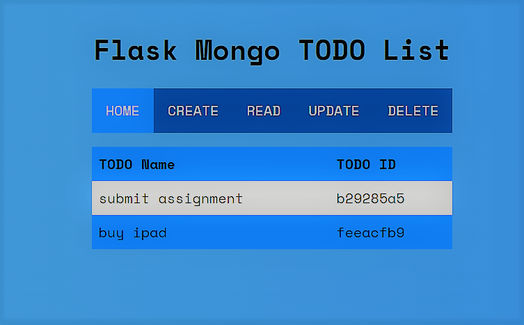
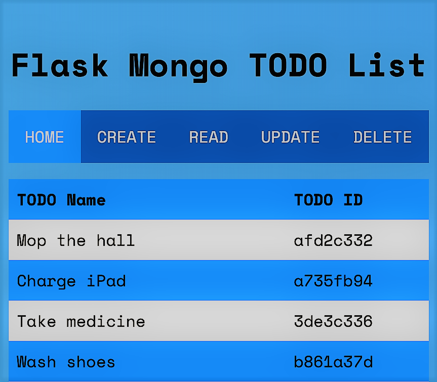

# flask_mongo_todo_list

## :dart: About ##

This is an easy app to use. The interface allows the user to execute basic CRUD operations. The programme will have access to list items through object ID.

## :rocket: Technologies ##

The following tools were used in this project:

- [Python](https://downloads.python.org/)
- [Pymongo](https://pymongo.readthedocs.io/)
- [flask](https://flask.palletsprojects.com/)
- [mongodb](https://www.mongodb.com/)
- HTML
- CSS

## :white_check_mark: Requirements ##

* First, clone the repo:

* Then, install python packages from requirements.txt:
```
pip install -r requirements.txt
```
* Set your own environment variables.
* Set your own MongoDB Atlas database and collection.
* Run `python3 main.py`.


<div align="center">
  

  

  

  
</div>

<br>

<div align="center">
  <p float="center">
  
   
</p>
</div>